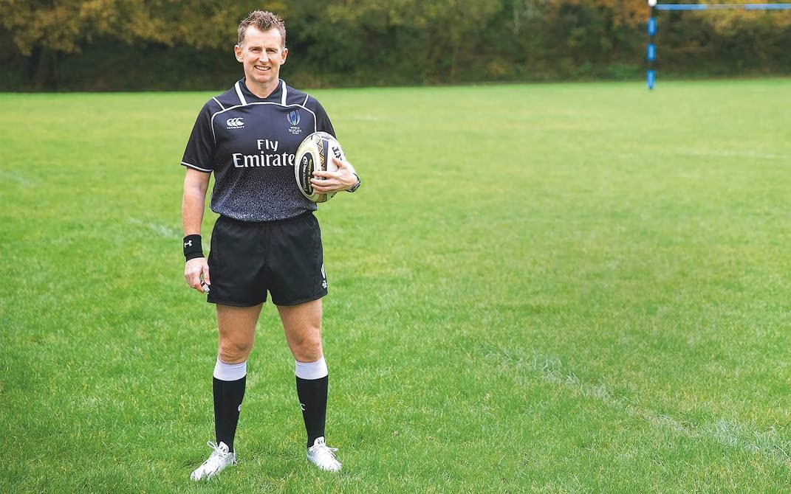

date: 15-09-23
title: Curso de Arbitragem em rugby N1
category: experience
image_url: ../../static/image.pn

# Aprendizados Adquiridos no Curso de Nível 1 de Arbitragem em Rugby

Durante o curso de Nível 1 de Arbitragem em Rugby, mergulhamos profundamente em um mundo de conhecimento e habilidades que vão muito além de simplesmente apitar um jogo. A arbitragem no rugby é uma função crucial que exige um profundo entendimento das regras, uma comunicação eficaz e a capacidade de tomar decisões rápidas e justas em um ambiente de alta pressão. Abaixo estão alguns dos principais aprendizados que adquirimos durante o curso:

1. **Conhecimento Profundo das Regras:** O rugby é conhecido por suas regras complexas e detalhadas. Através do curso, ganhamos um conhecimento profundo das regras do jogo, incluindo as nuances que muitas vezes passam despercebidas. Compreender as regras é fundamental para tomar decisões precisas durante o jogo.

2. **Comunicação Clara:** A arbitragem no rugby exige uma comunicação clara e eficaz com os jogadores, treinadores e outros árbitros. Aprendemos a importância de comunicar as decisões de forma transparente e concisa, mantendo o respeito e a credibilidade.

3. **Tomada de Decisões Rápidas:** Em um jogo de rugby, as situações podem mudar rapidamente, e um árbitro deve ser capaz de tomar decisões instantâneas. O curso nos ajudou a desenvolver a capacidade de analisar o jogo em tempo real e tomar decisões justas e imparciais.

4. **Gestão de Jogo:** Além de aplicar as regras, a arbitragem envolve a gestão do jogo como um todo. Isso inclui garantir que o jogo seja seguro, que haja respeito entre os jogadores e que o espírito esportivo seja mantido.

5. **Respeito pela Integridade do Jogo:** A integridade do rugby é fundamental, e um árbitro desempenha um papel vital em preservá-la. Aprendemos a importância de manter a imparcialidade, evitar conflitos de interesse e proteger a integridade do jogo.

6. **Desenvolvimento Pessoal:** Além dos aspectos técnicos da arbitragem, o curso também enfatizou o desenvolvimento pessoal. Aprendemos a lidar com a pressão, a manter a calma em situações desafiadoras e a desenvolver habilidades de liderança.

7. **Trabalho em Equipe:** A arbitragem muitas vezes envolve trabalhar em equipe com outros árbitros e oficiais do jogo. Aprendemos a importância da cooperação e coordenação com outros membros da equipe de arbitragem.

8. **Paixão pelo Rugby:** Por último, mas não menos importante, o curso reforçou nossa paixão pelo rugby. Aprofundar nosso conhecimento e envolver-nos mais profundamente no esporte como árbitros trouxe uma nova apreciação pela beleza e complexidade do jogo.

Em resumo, o curso de Nível 1 de Arbitragem em Rugby não apenas nos proporcionou um entendimento mais profundo das regras e técnicas de arbitragem, mas também nos ensinou valiosas lições de vida, como tomar decisões rápidas e justas, manter a integridade e respeito pelo esporte, e trabalhar em equipe. Estamos entusiasmados para aplicar esses aprendizados em campo e continuar nossa jornada como árbitros de rugby.

esse é o meu segundo post nesse blog, espero que gostem :) até aproxima!!!
