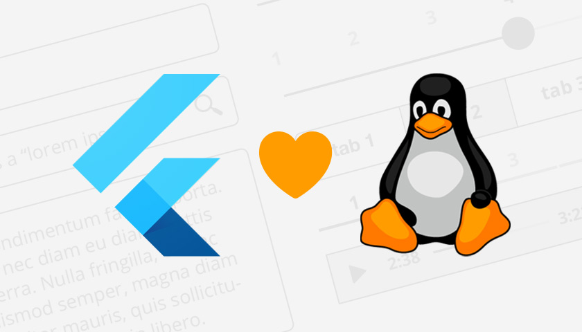

date: 15-09-23
title: flutter e linux
category: developer

# Desenvolvimento com Flutter no Linux: Uma Experiência Empolgante

O desenvolvimento de aplicativos móveis é uma área repleta de oportunidades e desafios empolgantes. Uma das escolhas mais interessantes para desenvolvedores que utilizam o sistema operacional Linux é o uso do framework Flutter, uma poderosa ferramenta que permite criar aplicativos nativos para Android e iOS a partir de uma única base de código. Abaixo estão algumas das coisas mais legais sobre usar Flutter para desenvolvimento no Linux:

## 1. **Cross-Platform por Natureza**

O Flutter é uma opção ideal para quem deseja desenvolver aplicativos multiplataforma sem sacrificar a qualidade. Você pode criar aplicativos nativos para Android e iOS usando a mesma base de código, economizando tempo e recursos significativos.

## 2. **Open Source e Comunidade Ativa**

Flutter é um projeto de código aberto mantido pelo Google, e sua comunidade é extremamente ativa. Isso significa que você tem acesso a uma ampla gama de recursos, bibliotecas e plugins desenvolvidos pela comunidade para acelerar o desenvolvimento de seu aplicativo.

## 3. **Hot Reload para Desenvolvimento Ágil**

Uma das características mais cativantes do Flutter é o "Hot Reload." Isso permite que você veja instantaneamente as mudanças que faz no código refletidas no aplicativo em execução, facilitando a iteração rápida e o desenvolvimento ágil.

## 4. **Performance e Nativas Capacidades**

Flutter se destaca quando se trata de desempenho. Ele é construído com a linguagem Dart, que é compilada para código nativo. Isso significa que seus aplicativos têm um desempenho tão bom quanto os aplicativos nativos, além de acessar todas as capacidades nativas do dispositivo.

## 5. **Widgets Personalizáveis**

O Flutter oferece uma ampla gama de widgets personalizáveis e flexíveis, permitindo que você crie interfaces de usuário incríveis. Você pode personalizar widgets ou criar os seus próprios para atender às necessidades específicas do seu aplicativo.

## 6. **Suporte Linux Desktop**

Além de Android e iOS, o Flutter também oferece suporte para desenvolvimento de aplicativos de desktop para Linux. Isso significa que você pode criar aplicativos para Linux com a mesma facilidade com que cria para outras plataformas.

## 7. **Documentação e Recursos de Aprendizado**

O Flutter possui uma documentação completa e recursos de aprendizado, incluindo cursos online, tutoriais e uma série de vídeos no YouTube. Isso torna a curva de aprendizado mais suave e acessível para desenvolvedores Linux.

## 8. **Comunidade Engajada**

A comunidade Flutter é conhecida por ser acolhedora e atenciosa. Fóruns, grupos de discussão e redes sociais estão repletos de desenvolvedores dispostos a ajudar e compartilhar conhecimento.

Em resumo, o desenvolvimento com Flutter no Linux é uma experiência emocionante e gratificante. A capacidade de criar aplicativos nativos de alta qualidade para diversas plataformas, juntamente com a ativa comunidade Flutter e o suporte para desenvolvimento de desktop Linux, torna o Flutter uma escolha excelente para desenvolvedores Linux que desejam entrar no mundo do desenvolvimento móvel.
